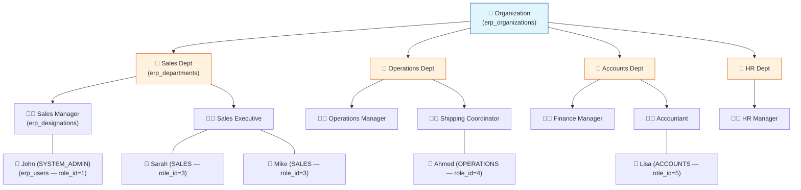
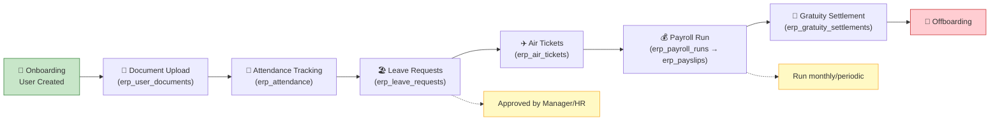
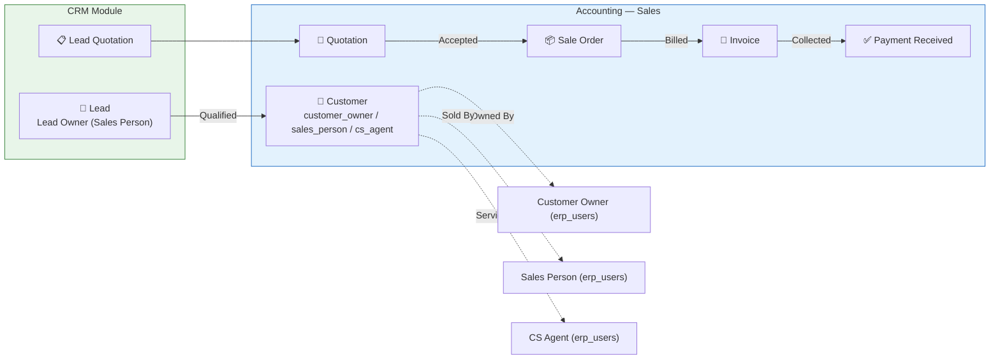
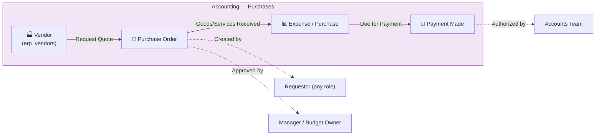
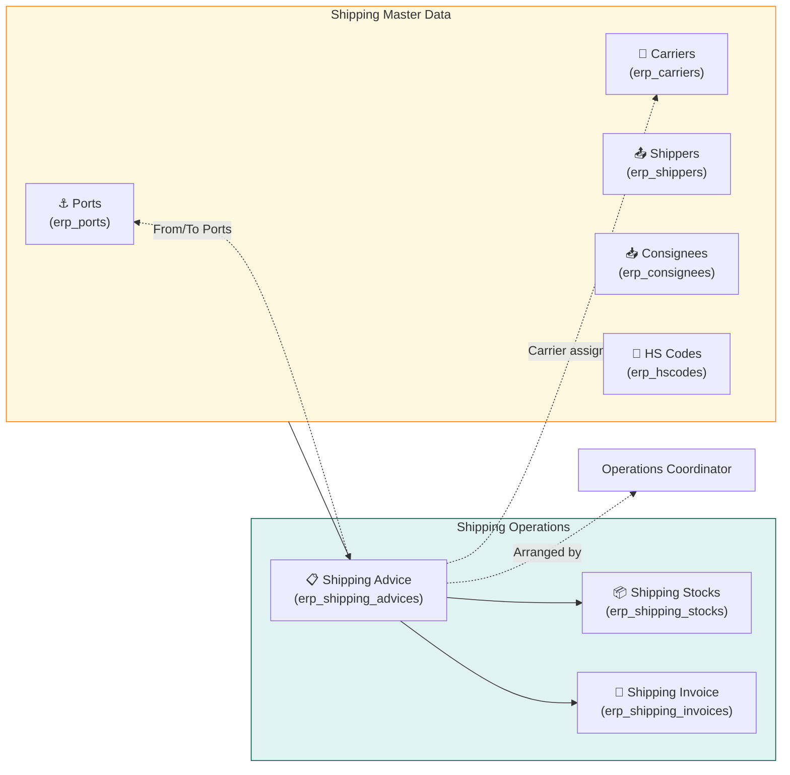

# Manpower Flow Charts — Haizon ERP

> **⚠️ PROTECTED FILE**: Do NOT delete, rename, or move this file without explicit user approval.

> Designed from the existing codebase data model (HR, CRM, Accounting, Shipping modules).
> All diagrams are [Mermaid](https://mermaid.js.org/) syntax — render in any Mermaid-compatible viewer.

---

## 1. Organizational Hierarchy Chart

Shows the reporting and structural hierarchy: Organization → Departments → Designations → Employees → Roles.

**Data mapping:**
- `erp_organizations.id` — multi-tenant root
- `erp_departments.id` → `erp_users.department_id`
- `erp_designations.id` → `erp_users.designation_id`
- `erp_roles.id` → `erp_users.role_id` (1=SYSTEM_ADMIN, 2=SUPER_ADMIN, 3=SALES, 4=OPERATIONS, 5=ACCOUNTS)

---

## 2. Employee Lifecycle Flow

Tracks an employee's journey from onboarding through offboarding.

**Entities involved:**
- `erp_users` — employee record
- `erp_user_documents` — passport, visa, ID, contracts
- `erp_attendance` — daily punches
- `erp_leave_requests` — leave with approval status
- `erp_annual_leave_entitlements` — yearly leave balance per user
- `erp_air_tickets` — flight bookings
- `erp_salary_structures` → `erp_employee_salaries` → `erp_payroll_runs` → `erp_payslips`
- `erp_gratuity_settlements` — end-of-service calculation

---

## 3. Sales-to-Cash Team Flow (CRM → Accounting)

Shows how sales and accounts teams interact across the order-to-cash cycle.

**Team roles in process:**

| Step | Role | Module |
|------|------|--------|
| Lead qualification | Sales Person (role_id=3) | CRM |
| Quotation sent | Sales Person | Accounting |
| Sale Order approval | Sales Manager / Accounts | Accounting |
| Invoice generation | Accounts (role_id=5) | Accounting |
| Payment collection | Accounts | Accounting |

**FK columns:** `erp_customers.sales_person`, `erp_customers.customer_owner`, `erp_customers.cs_agent`, `erp_customers.assigned_to` → `erp_users.id`

---

## 4. Procure-to-Pay Team Flow (Accounting)

Shows how purchasing and accounts payable teams interact.

---

## 5. Shipping Operations Flow

Shows the freight/logistics operations team workflow.

**Team roles:**
- Operations Manager — oversees all shipping workflows
- Shipping Coordinator — creates shipping advices, coordinates carriers
- Accounts — generates shipping invoices, tracks payments

---

## 6. Approval Workflow Chain

Cross-module approval flows that different manpower roles participate in.

```mermaid
flowchart TD
    subgraph Leave["Leave Approval (HR)"]
        L1["👤 Employee submits leave request"]
        L2["📋 Manager approves"]
        L3["✅ HR confirms"]
        L4["✔️ Leave Granted"]
        L1 --> L2 --> L3 --> L4
    end

    subgraph PO["Purchase Approval (Accounting)"]
        P1["👤 Requestor creates PO"]
        P2["📋 Budget Owner approves"]
        P3["✅ Purchase Order finalized"]
        P1 --> P2 --> P3
    end

    subgraph Expense["Expense Claim (Accounting)"]
        E1["👤 Employee submits expense"]
        E2["📋 Manager reviews"]
        E3["✅ Accounts verifies & pays"]
        E1 --> E2 --> E3
    end

    subgraph InvoicePay["Invoice Payment (Accounting)"]
        I1["📄 Invoice received"]
        I2["📋 Operations confirms delivery"]
        I3["✅ Accounts processes payment"]
        I1 --> I2 --> I3
    end

    style Leave fill:#e8f5e9,stroke:#2e7d32
    style PO fill:#fff3e0,stroke:#e65100
    style Expense fill:#fce4ec,stroke:#c62828
    style InvoicePay fill:#e3f2fd,stroke:#1565c0
```

**Role-to-approval mapping:**

| Flow | Initiator | Approver 1 | Approver 2 |
|------|-----------|------------|------------|
| Leave | Employee (any) | Manager (SUPER_ADMIN / Dept Head) | HR |
| Purchase Order | Requestor (SALES/OPS) | Budget Owner (ACCOUNTS) | — |
| Expense Claim | Employee (any) | Manager | Accounts |
| Invoice Payment | Vendor / System | Operations | Accounts |

---

## Implementation Notes

### Data Source Summary

| Chart | Primary Tables | Key FK Columns |
|-------|---------------|----------------|
| Org Hierarchy | `erp_departments`, `erp_designations`, `erp_users`, `erp_roles` | `department_id`, `designation_id`, `role_id` |
| Employee Lifecycle | `erp_users`, `erp_attendance`, `erp_leave_requests`, `erp_payroll_runs`, `erp_payslips`, `erp_air_tickets`, `erp_gratuity_settlements` | `user_id` across all |
| Sales-to-Cash | `erp_customers`, `erp_quotations`, `erp_sale_orders`, `erp_invoices`, `erp_payments_received` | `sales_person`, `customer_owner`, `cs_agent`, `assigned_to` |
| Procure-to-Pay | `erp_vendors`, `erp_purchase_orders`, `erp_expenses`, `erp_payments_made` | `created_by` |
| Shipping Ops | `erp_shipping_advices`, `erp_shipping_invoices`, `erp_shipping_stocks` + master data | `carrier_id`, `port_id`, `shipper_id`, `consignee_id` |
| Approvals | Various `status` fields on leave, PO, expense, invoice tables | `status` (pending/approved/rejected) |

### Future Enhancement Ideas

- Add a dedicated `approval_flows` table for configurable multi-tier approval chains
- Introduce an `erp_employee_supervisors` table for flexible manager-subordinate mapping (currently implicit via hierarchy)
- Build org chart visualization directly into the dashboard (front-end with Mermaid.js) using existing repo/service data
- Surface approval bottlenecks in dashboard KPI widgets
